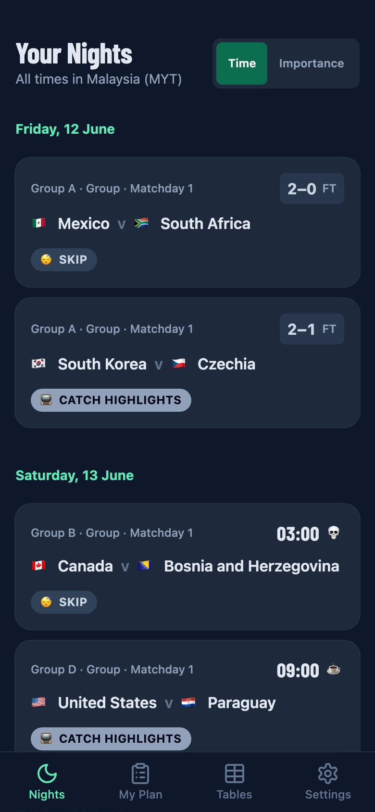
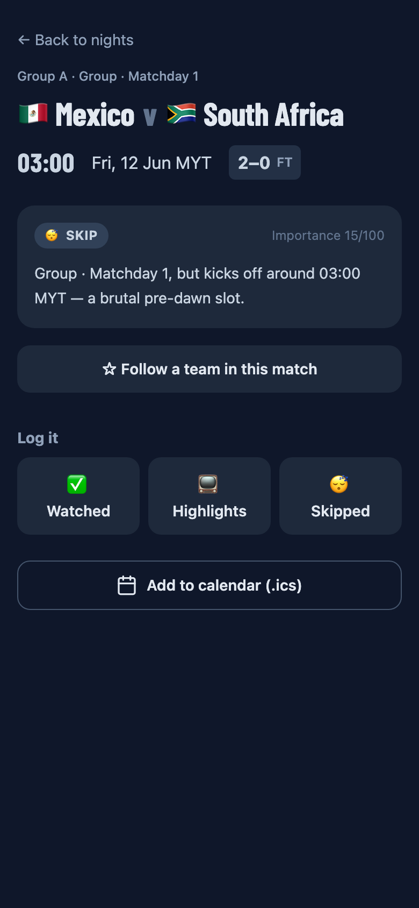
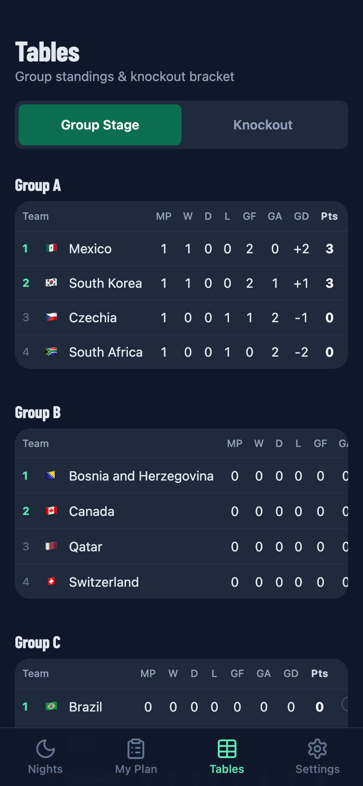
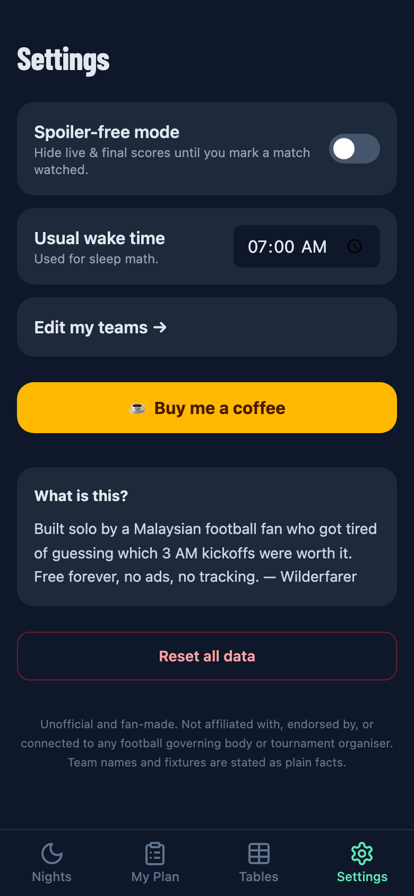

<div align="center">

# 🌙 3AM Club — *Worth Staying Up For*

**The 2026 football World Cup, on Malaysia time.**
Which matches are actually worth losing sleep over? This tells you.

[](https://3am-club.pages.dev)


</div>

---

## ☕ The problem

The 2026 World Cup is in North America. For fans in Malaysia (and most of SEA), **every single kickoff lands between roughly midnight and 8 AM**. You *want* to watch — but which 3 AM match is genuinely worth wrecking your sleep for, and which can you skip and just catch the highlights?

**3AM Club** answers exactly that. Pick your teams, and it turns the whole tournament into a **night-by-night plan in Malaysia time**, with a one-glance verdict on every match and a running tally of the sleep you're about to sacrifice. 💀

<div align="center">

|  Your Nights  |  Match verdict  |
| :-----------: | :-------------: |
|  |  |
|  **Tables**   |  **Settings**   |
|  |  |

</div>

---

## ✨ Features

- ⚽ **Real 2026 fixtures** — the authentic draw, kickoff times converted to **MYT (UTC+8)**.
- 🔴 **Live scores** while matches are on, and **final scores** after — refreshed straight from the source.
- 🧮 **The verdict engine** — every match scored on importance + sleep cost → `WATCH LIVE 🔥`, `WORTH THE PAIN 💪`, `YOUR CALL 🤔`, `CATCH HIGHLIGHTS 📺`, or `SKIP 😴`.
- 💀 **Sleep-debt tracker** — see how many pre-dawn matches and hours of sleep your plan really costs.
- 📊 **Tables** — live group standings + the knockout bracket, auto-filling as teams qualify.
- 🙈 **Spoiler-free mode** — hides scores until you mark a match watched, so the replay isn't ruined.
- 📲 **Installable PWA** — add it to your home screen; works offline.
- 🗓️ **Add to calendar** — one tap to drop a match into your calendar (.ics).

---

## 🛠️ How it works

> No backend server. No exposed API keys. Free to host.

```
                                      ┌──────────────────────────┐
  Browser (React PWA)                 │   Cloudflare Pages        │
  ──────────────────                  │                           │
  • baked fixtures  ◄── first paint ──┤  static assets + SW       │
  • /api/fixtures  ───────────────────►  Pages Function (proxy) ──┐
  • /api/live      ───────────────────►  Pages Function (proxy) ──┤
                                      └──────────────────────────┘ │
                                          key stays server-side    ▼
                                                            football-data.org
```

- **Build time** bakes the real schedule into the app, so the first paint is instant and it works offline.
- **At runtime**, two **Cloudflare Pages Functions** proxy the football data API — the API key lives as a server-side secret and is **edge-cached** (schedule 6 h, live scores 90 s), so it stays comfortably inside the free tier.
- The client only polls for live scores **while a match is actually in progress and the tab is visible**.
- All times render in a **fixed `Asia/Kuala_Lumpur` timezone** (UTC+8, no DST) regardless of the user's device.

**Stack:** React 19 · Vite 6 · Tailwind v4 · vite-plugin-pwa · Cloudflare Pages + Functions · Vitest.

---

## 🚀 Run it locally

```bash
npm install
npm run dev            # local dev server
npm test               # scoring + timezone + standings unit tests
npm run build          # production build -> dist/
```

To refresh the baked schedule from the real source, grab a free key at
[football-data.org](https://www.football-data.org/client/register), add it to `.env`
as `FOOTBALL_DATA_KEY`, then:

```bash
npm run fetch-fixtures
```

To test the Cloudflare Functions (`/api/*`) locally:

```bash
npx wrangler pages dev dist --binding FOOTBALL_DATA_KEY=your-key
```

## ☁️ Deploy (Cloudflare Pages)

1. Push to GitHub and connect the repo in Cloudflare Pages.
2. Build command `npm run build` · output directory `dist`.
3. Add `FOOTBALL_DATA_KEY` as an **encrypted environment variable** (Settings → Environment variables).
4. Deploy. The `/functions` directory is picked up automatically — no extra config.

---

## ⚖️ Disclaimer

Unofficial and fan-made. Not affiliated with, endorsed by, or connected to any football
governing body or tournament organiser. No licensed crests or marks (emoji flags only),
no betting. Team names and fixtures are stated as plain facts. Fixture data via
[football-data.org](https://www.football-data.org/).

<div align="center">

Built solo by a Malaysian football fan who got tired of guessing which 3 AM kickoffs were worth it.
**Free forever · no ads · no tracking.** ☕

</div>
